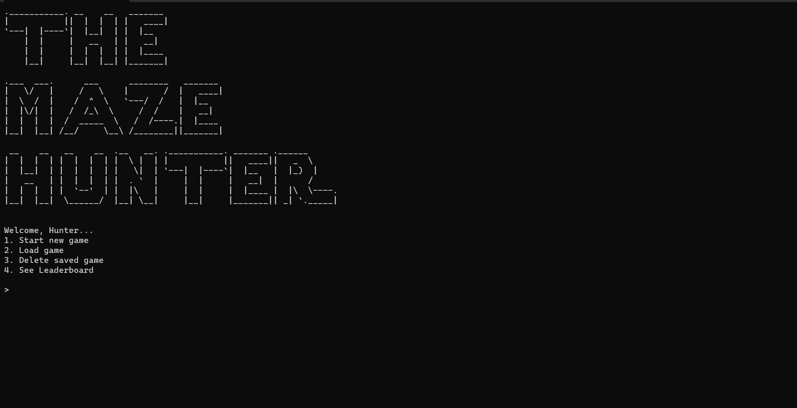

# The Maze Hunter



---

### Description

The Maze Hunter is a CLI-Based Maze Adventure game, fully written in Python, where players can play a simple maze treasure hunting game directly in the terminal.


### How things work

The game is simple, you will be shown a maze (or an arena if you will) similar to this:

```
@   #   .   #   💎
.   .   #   .   .
#   .   #   #   .
.   .   #   .   .
.   .   .   .   .
```

Each dot `.` represents the path that can be crossed by the player (symbolized with `@`), and those blocked with `#` can't be crossed by the player.

The objective is simple, to get the treasure (in this case, the 💎).
Players can make their own save game (a character, if you will) to keep their progress tracked, a name and 6-digit passcode will be prompted to ensure security!

Players can keep a track of how many diamonds do they have, how many score have they achieved, up until the rank of their own character!

Players can play the game as much as they want to grind their diamond count and rank up from `Newbie` to `The Maze Hunter`!


### Tutorial

Upon program launch, players will be prompted a menu selection:

```
1. Start New game
2. Load Game
3. Delete Saved Game
4. See Leaderboard
```

Pretty much self-explanatory, you can either start a new game or load your previously saved game --- or you can decide to retire as a Maze Hunter and delete your saved game :(

To see the competitiveness of the players, it is possible to see the leaderboard of top 10 ranked players!

### Tips & Tricks

- If you're stuck in the maze, typing in `:(` will restart the maze to a new one!
- Higher level = higher rewards
- `The Maze Hunter` is the highest rank in the game with minimum score of `10000`
